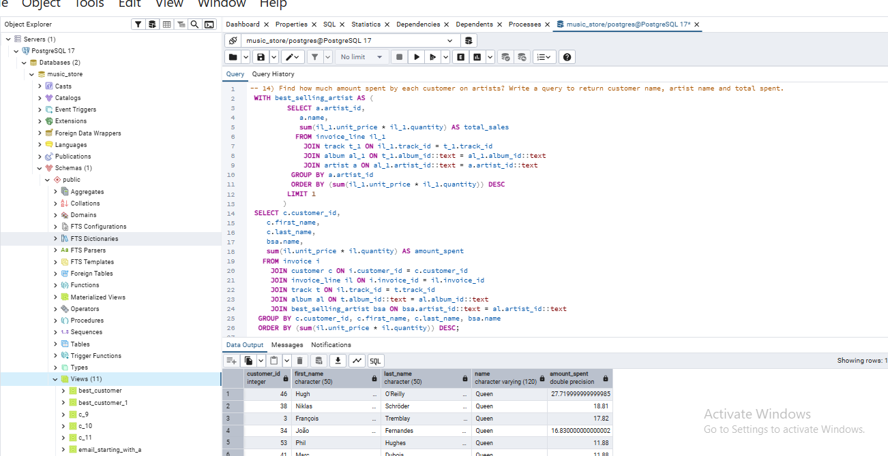

# Music-Store-Consumer-Intelligence-Engine
A comprehensive SQL analytics project executing advanced relational queries to uncover consumer purchasing patterns, track track popularity, and evaluate global invoice data for an international digital music store.
## Database Analysis & Insights
Below is a visual snapshot of the music store database insights and analytics query output:

